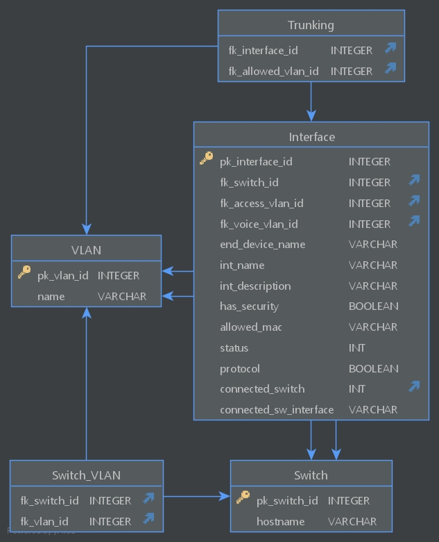

Database
=====

.. _installation:

.. code-block:: sql

  CREATE TABLE Switch
  (
      pk_switch_id INTEGER PRIMARY KEY AUTOINCREMENT,
      hostname     varchar(20) UNIQUE
  );

  CREATE TABLE VLAN
  (
      pk_vlan_id INTEGER PRIMARY KEY,
      name       varchar(20)
  );

  CREATE TABLE Interface
  (
      pk_interface_id        INTEGER PRIMARY KEY AUTOINCREMENT,
      fk_switch_id           INTEGER,
      fk_access_vlan_id      INTEGER,
      fk_voice_vlan_id       INTEGER,
      end_device_name        varchar(20),
      int_name               varchar(10),
      int_description        varchar(20),
      has_security           boolean,
      allowed_mac            varchar(17),
      status                 INT, /* -1=admin_down, 0=down, 1=up */
      protocol               boolean,
      connected_switch       int,
      connected_sw_interface varchar(10),
      CONSTRAINT switch_interface FOREIGN KEY (fk_switch_id) REFERENCES Switch (pk_switch_id) ON DELETE CASCADE,
      CONSTRAINT vlan_interface FOREIGN KEY (fk_access_vlan_id) REFERENCES VLAN (pk_vlan_id) ON DELETE SET NULL,
      CONSTRAINT voice_vlan FOREIGN KEY (fk_voice_vlan_id) REFERENCES VLAN (pk_vlan_id) ON DELETE SET NULL,
      CONSTRAINT conntected_switch FOREIGN KEY (connected_switch) REFERENCES Switch (pk_switch_id) ON DELETE SET NULL
  );

  CREATE TABLE Switch_VLAN
  (
      fk_switch_id INTEGER,
      fk_vlan_id   INTEGER,
      CONSTRAINT vlan_switch FOREIGN KEY (fk_switch_id) REFERENCES Switch (pk_switch_id) ON DELETE CASCADE,
      CONSTRAINT switch_vlan FOREIGN KEY (fk_vlan_id) REFERENCES VLAN (pk_vlan_id) ON DELETE CASCADE
  );

  CREATE TABLE Trunking
  (
      fk_interface_id    INTEGER,
      fk_allowed_vlan_id INTEGER,
      CONSTRAINT trunk_interface FOREIGN KEY (fk_interface_id) REFERENCES Interface (pk_interface_id) ON DELETE CASCADE,
      CONSTRAINT trunk_vlan FOREIGN KEY (fk_allowed_vlan_id) REFERENCES VLAN (pk_vlan_id) ON DELETE CASCADE
  );

Tabellen
--------

VLAN
^^^^

VLAN ist die Tabelle für die VLANs im gesamten Netzwerk. In dieser Tabelle werden VLAN-ID und der dazugehörige Name gespeichert.

- ``name`` - Name des VLANs

- ``pk_vlan_id`` - ID des VLANs

Trunking
^^^^^^^^

Die Trunking-Tabelle dient dazu, um die getrunkten VLANs zu den jeweiligen Interfaces zu mappen.

- ``fk_interface_id`` - Interface auf welchem ein VLAN getrunked wird; Pointed auf Interface(``pk_interface_id``)

- ``fk_allowed_vlan_id`` - VLAN welches auf einem Interface getrunked wird; Pointed auf VLAN(``pk_vlan_id``)

Interface
^^^^^^^^^

Die Interface-Tabelle speichert sämtliche Informationen zu allen Interfaces von Interface Description bis VLANs.

- ``fk_switch_id`` - ID von dem Switch dem das Inteface gehört; Pointed auf Switch(``pk_switch_id``)

- ``fk_access_vlan`` - ID von dem VLAN welches als Access VLAN auf dem Interface konfiguriert ist; Pointed auf VLAN(``pk_vlan_id``)

- ``fk_voice_vlan`` - ID von dem VLAN welches als Voice VLAN auf dem Interface konfiguriert ist; Pointed auf VLAN(``pk_vlan_id``)

- ``end_device_name`` - Name des ageschlossenen Endgerätes

- ``int_name`` - Interface Bezeichnung auf dem Switch

- ``int_description`` - Description auf dem Interface

- ``has_security`` - Boolean Feld für das Vorhandensein von Switchport Port-Security

- ``allowed_mac`` - MAC welche von Switchport Security erlaubt wird

- ``status`` - Status vom Interface (**-1** = ``admin_down``, **0** = ``down``, **1** = ``up``)

- ``protocol`` - Boolean für Protocol Status (Up / Down)

- ``connected_switch`` - Der verbundene Switch auf dem Interface

- ``connected_sw_interface`` - Das gegenüberliegende Interface des verbundenen Switches

Switch_VLAN
^^^^^^^^^^^

Die Switch_VLAN-Tabelle gibt an welche VLANs auf welchen Switches vorhanden ist.

- ``fk_switch_id`` - ID von dem Switch auf dem das VLAN vorhanden ist; Pointed auf Switch(``pk_switch_id``)

- ``fk_vlan_id`` - VLAN welches auf dem Switch vorhanden ist; Pointed auf VLAN(``pk_vlan_id``)

Switch
^^^^^^

Die Switch-Tabelle beinhaltet jeden Switch im gesamten Netzwerk.

- ``pk_switch_id`` - ID von dem Switch

- ``hostname`` - Hostname auf dem Switch

Constraints
-----------

VLAN(pk_vlan_id)
^^^^^^^^^^^^^^^^

- ``AUTOINCREMENT``

- ``ON DELETE CASCADE`` → Trunking(``fk_allowed_vlan_id``)

- ``ON DELETE CASCADE`` → Switch_VLAN(``fk_vlan_id``)

- ``ON DELETE SET NULL`` → Interface(``fk_access_vlan``)

- ``ON DELETE SET NULL`` → Interface(``fk_voice_vlan_id``)

Switch(pk_switch_id)
^^^^^^^^^^^^^^^^^^^^

- ``AUTOINCREMENT``

- ``ON DELETE CASCADE`` → Switch_Vlan(``fk_switch_id``)

- ``ON DELETE CASCADE`` → Interface(``fk_switch_id``)

Interface(pk_interface_id)
^^^^^^^^^^^^^^^^^^^^^^^^^^
- ``AUTOINCREMENT``

- ``ON DELETE CASCADE`` → Trunking(``fk_interface_id``)
